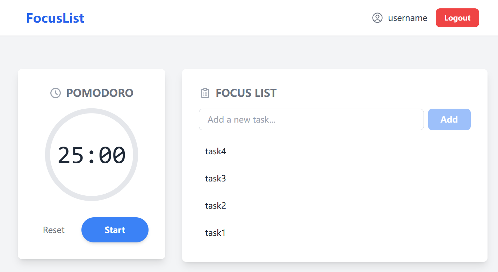
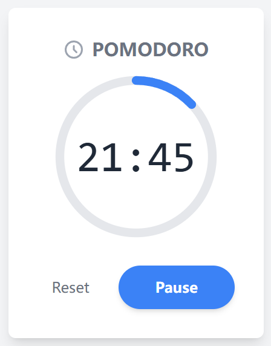
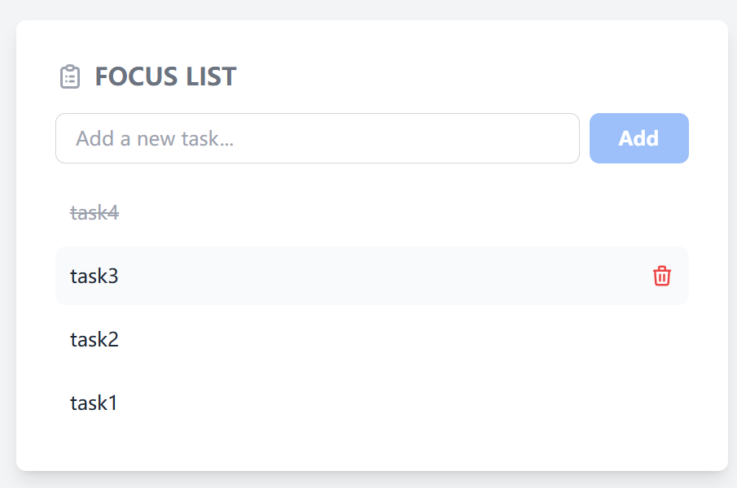

# Focus List - 专注力管理应用

**Languages**: [English](#english) | [日本語](#japanese) | [中文](#chinese)

---

## <a id="english"></a>English

**Languages**: English | [日本語](#japanese) | [中文](#chinese)

# Focus List - Focus Management Application

A full-stack web application that combines Pomodoro Technique and task management to help users improve focus and productivity.

## 🚀 Project Highlights

**Full-Stack Development**: Built with MERN (MongoDB, Express, React, Node.js) stack

- **User System**: Complete user registration, login, and authentication flow
- **Task Management**: Create, delete, and mark todo items as complete
- **Pomodoro Timer**: Focus timing functionality based on the Pomodoro Technique
- **Real-time Feedback**: Sound alerts and visual feedback

## 🛠️ Tech Stack

- **Frontend**: React + Vite + Tailwind CSS
- **Backend**: Node.js + Express
- **Database**: MongoDB + Mongoose
- **State Management**: React Context API
- **Authentication**: JWT (JSON Web Token)

### Development Tools

- **Vite** - Modern build tool
- **ESLint** - Code quality checking
- **Prettier** - Code formatting tool
- **Nodemon** - Automatic development server restart

## 📁 Project Structure

```
focus-list/
├── client/                    # Frontend React App (Vite)
│   ├── public/
│   │   └── sounds/           # Sound effects and static assets
│   ├── src/
│   │   ├── api/              # API request modules
│   │   ├── components/       # Reusable components
│   │   ├── context/          # Global state management
│   │   ├── pages/            # Page-level components
│   │   ├── utils/            # Utility functions
│   │   ├── App.jsx           # App root component
│   │   └── main.jsx          # App entry file
│   ├── .env.example          # Environment variables example
│   ├── package.json          # Frontend dependencies & scripts
│   └── vite.config.js        # Vite configuration
├── screenshots/
├── server/                   # Backend Express App
│   ├── middleware/           # Express middleware
│   ├── models/               # Mongoose data models
│   ├── routes/               # API routes
│   ├── .env.example          # Environment variables example
│   ├── package.json          # Backend dependencies & scripts
│   └── server.js             # Server entry file
├── .gitignore                # Git ignore configuration
└── README.md                 # Project documentation
```

## ✨ Core Features

### 🔐 User Authentication System

- User registration and login
- JWT Token authentication
- Secure password handling
- Automatic login state persistence

### 📝 Task Management

- Create and delete tasks
- Toggle task status (complete/incomplete)
- Real-time data synchronization

### ⏰ Pomodoro Timer

- 25-minute focus sessions
- Background Web Worker ensures accurate timing
- Sound alerts and visual notifications
- Timer history tracking

### 🎵 User Experience

- Intuitive interface design
- Smooth animation effects
- Sound feedback system

## 🚀 Quick Start

### Requirements

- [Node.js](https://nodejs.org/) (v16 or higher recommended)
- [npm](https://www.npmjs.com/) or [yarn](https://yarnpkg.com/)
- [MongoDB](https://www.mongodb.com/) (requires a running database instance, can be local installation or cloud service like MongoDB Atlas)

### Install Dependencies

```bash
# Install client dependencies
cd client
npm install

# Install server dependencies
cd ../server
npm install
```

### Environment Configuration

```bash
# 1. Configure Backend (Server)
# Enter server folder from project root
cd server
cp .env.example .env # Copy template file
# Edit .env file, fill in your MongoDB connection string and JWT secret

# 2. Configure Frontend (Client)
# Return to root directory and enter client folder
cd ../client
cp .env.example .env # Copy template file
# (Optional) If your backend API address is not http://localhost:5000, modify .env file
```

### Start Application

```bash
# Start backend server
cd server
npm run dev

# Start frontend development server
cd client
npm run dev
```

## 📸 Feature Demo

- **Login Interface**: Clean user authentication page
  

- **Main Dashboard**: Perfect integration of task list and timer
  

- **Timer Status**: Visual representation of focus time
  

- **Task Management**: Intuitive task operation interface
  

## 🎯 Project Highlights

### Technical Implementation

- **Clear Architecture**: Adopts frontend-backend separation pattern with distinct responsibilities, easy for independent development and maintenance
- **State Management**: Uses Context API for global state management
- **Performance Optimization**: Processes timer logic in background through Web Worker, ensuring timing accuracy while avoiding main thread blocking and improving UI fluency

### Feature Design

- **Focus Science**: Based on Pomodoro Technique to improve work efficiency
- **User-Friendly**: Clean and intuitive interface design
- **Data Security**: JWT authentication ensures user data security
- **Real-time Sync**: Task status updates in real-time

## 🎯 Project Summary

This project serves as a full-stack development practice, primarily aimed at demonstrating MERN stack application and modern web application development workflow. The project has achieved its expected core functionality goals with no planned future updates.

## 👨💻 Developer Information

**This project demonstrates the following skills:**

- Full-stack web development capabilities
- Proficient use of React ecosystem
- Node.js backend development experience
- RESTful API design practice
- User experience design thinking
- Project architecture design ability

### About Me

- **GitHub**: [LeoYann](https://github.com/ENAwareness)
- **Email**: leoyann724@gmail.com

---

_This project reflects my comprehensive abilities in full-stack development, user experience design, and project management. Through reasonable technology selection and architectural design, I implemented a feature-complete, user-friendly focus management application._

---

## <a id="japanese"></a>日本語

**言語**: [English](#english) | 日本語 | [中文](#chinese)

# Focus List - 集中力管理アプリケーション

ポモドーロテクニックとタスク管理を組み合わせたフルスタック Web アプリケーションで、ユーザーの集中力と作業効率の向上をサポートします。

## 🚀 プロジェクトハイライト

**フルスタック開発**: MERN (MongoDB, Express, React, Node.js) スタックで構築

- **ユーザーシステム**: 完全なユーザー登録、ログイン、認証フロー
- **タスク管理**: ToDo 項目の作成、削除、完了マーク機能
- **ポモドーロタイマー**: ポモドーロテクニックに基づく集中時間機能
- **リアルタイムフィードバック**: 音響アラートと視覚的なフィードバック

## 🛠️ 技術スタック

- **フロントエンド**: React + Vite + Tailwind CSS
- **バックエンド**: Node.js + Express
- **データベース**: MongoDB + Mongoose
- **状態管理**: React Context API
- **認証**: JWT (JSON Web Token)

### 開発ツール

- **Vite** - モダンビルドツール
- **ESLint** - コード品質チェック
- **Prettier** - コードフォーマッティングツール
- **Nodemon** - 開発サーバー自動再起動

## 📁 プロジェクト構造

```
focus-list/
├── client/                    # フロントエンド React アプリ (Vite)
│   ├── public/
│   │   └── sounds/           # 音響効果と静的アセット
│   ├── src/
│   │   ├── api/              # APIリクエストモジュール
│   │   ├── components/       # 再利用可能コンポーネント
│   │   ├── context/          # グローバル状態管理
│   │   ├── pages/            # ページレベルコンポーネント
│   │   ├── utils/            # ユーティリティ関数
│   │   ├── App.jsx           # アプリルートコンポーネント
│   │   └── main.jsx          # アプリエントリファイル
│   ├── .env.example          # 環境変数例
│   ├── package.json          # フロントエンド依存関係とスクリプト
│   └── vite.config.js        # Vite設定ファイル
├── screenshots/
├── server/                   # バックエンド Express アプリ
│   ├── middleware/           # Express ミドルウェア
│   ├── models/               # Mongoose データモデル
│   ├── routes/               # API ルート
│   ├── .env.example          # 環境変数例
│   ├── package.json          # バックエンド依存関係とスクリプト
│   └── server.js             # サーバーエントリファイル
├── .gitignore                # Git 除外設定
└── README.md                 # プロジェクト説明文書
```

## ✨ 主要機能

### 🔐 ユーザー認証システム

- ユーザー登録とログイン
- JWT Token 認証
- 安全なパスワード処理
- 自動ログイン状態維持

### 📝 タスク管理

- タスクの作成と削除
- タスク状態切り替え（完了/未完了）
- リアルタイムデータ同期

### ⏰ ポモドーロタイマー

- 25 分間の集中セッション
- バックグラウンド Web Worker による正確なタイミング
- 音響アラートと視覚的な通知
- タイマー履歴追跡

### 🎵 ユーザーエクスペリエンス

- 直感的なインターフェースデザイン
- スムーズなアニメーション効果
- 音響フィードバックシステム

## 🚀 クイックスタート

### 必要環境

- [Node.js](https://nodejs.org/) (v16 以上推奨)
- [npm](https://www.npmjs.com/) または [yarn](https://yarnpkg.com/)
- [MongoDB](https://www.mongodb.com/) (実行中のデータベースインスタンスが必要。ローカルインストールまたは MongoDB Atlas などのクラウドサービス)

### 依存関係のインストール

```bash
# クライアント依存関係のインストール
cd client
npm install

# サーバー依存関係のインストール
cd ../server
npm install
```

### 環境設定

```bash
# 1. バックエンド設定 (Server)
# プロジェクトルートからserverフォルダに入る
cd server
cp .env.example .env # テンプレートファイルをコピー
# .envファイルを編集し、MongoDBコネクション文字列とJWTシークレットを入力

# 2. フロントエンド設定 (Client)
# ルートディレクトリに戻り、clientフォルダに入る
cd ../client
cp .env.example .env # テンプレートファイルをコピー
# (オプション) バックエンドAPIアドレスがhttp://localhost:5000でない場合、.envファイルを修正
```

### アプリケーション起動

```bash
# バックエンドサーバー起動
cd server
npm run dev

# フロントエンド開発サーバー起動
cd client
npm run dev
```

## 📸 機能デモ

- **ログインインターフェース**: シンプルなユーザー認証ページ
  

- **メインダッシュボード**: タスクリストとタイマーの完璧な統合
  

- **タイマー状態**: 集中時間の視覚的表現
  

- **タスク管理**: 直感的なタスク操作インターフェース
  

## 🎯 プロジェクトハイライト

### 技術実装

- **明確なアーキテクチャ**: フロントエンド・バックエンド分離パターンを採用し、責任が明確で独立した開発・保守が容易
- **状態管理**: Context API を使用したグローバル状態管理
- **パフォーマンス最適化**: Web Worker でバックグラウンドでタイマーロジックを処理し、タイミングの正確性を確保しながらメインスレッドのブロックを回避し UI の流暢性を向上

### 機能設計

- **集中力科学**: ポモドーロテクニックに基づく作業効率向上
- **ユーザーフレンドリー**: シンプルで直感的なインターフェースデザイン
- **データセキュリティ**: JWT 認証によるユーザーデータの安全性確保
- **リアルタイム同期**: タスク状態のリアルタイム更新

## 🎯 プロジェクト総括

このプロジェクトはフルスタック開発の実践として、主に MERN スタックの応用とモダン Web アプリケーション開発フローの実証を目的としています。プロジェクトは期待される核心機能目標を達成しており、今後の更新計画はありません。

## 👨💻 開発者情報

**このプロジェクトは以下のスキルを実証しています:**

- フルスタック Web 開発能力
- React エコシステムの熟練した活用
- Node.js バックエンド開発経験
- RESTful API 設計実践
- ユーザーエクスペリエンス設計思考
- プロジェクトアーキテクチャ設計能力

### 私について

- **GitHub**: [LeoYann](https://github.com/ENAwareness)
- **メール**: leoyann724@gmail.com

---

_このプロジェクトは、フルスタック開発、ユーザーエクスペリエンス設計、プロジェクト管理における私の総合的な能力を反映しています。合理的な技術選択とアーキテクチャ設計により、機能完備でユーザーフレンドリーな集中力管理アプリケーションを実装しました。_

---

## <a id="chinese"></a>中文

**语言**: [English](#english) | [日本語](#japanese) | 中文

# Focus List - 专注力管理应用

一个结合番茄钟技术和任务管理的全栈 Web 应用,帮助用户提高专注力和工作效率。

## 🚀 项目亮点

**全栈开发**:基于 MERN (MongoDB, Express, React, Node.js) 技术栈

- **用户系统**:完整的用户注册、登录、认证流程
- **任务管理**:创建、删除、标记完成待办事项
- **番茄钟计时器**:基于番茄工作法的专注计时功能
- **实时反馈**:音效提醒和视觉反馈

## 🛠️ 技术栈

- **前端**: React + Vite + Tailwind CSS
- **后端**: Node.js + Express
- **数据库**: MongoDB + Mongoose
- **状态管理**: React Context API
- **认证**: JWT (JSON Web Token)

### 开发工具

- **Vite** - 现代化构建工具
- **ESLint** - 代码质量检查
- **Prettier** - 代码格式化工具
- **Nodemon** - 开发服务器自动重启

## 📁 项目结构

```
focus-list/
├── client/                    # 前端 React 应用 (Vite)
│   ├── public/
│   │   └── sounds/           # 音效等静态资源
│   ├── src/
│   │   ├── api/              # API 请求模块
│   │   ├── components/       # 可复用组件
│   │   ├── context/          # 全局状态管理
│   │   ├── pages/            # 页面级组件
│   │   ├── utils/            # 工具函数
│   │   ├── App.jsx           # 应用根组件
│   │   └── main.jsx          # 应用入口文件
│   ├── .env.example          # 环境变量示例
│   ├── package.json          # 前端依赖与脚本
│   └── vite.config.js        # Vite 配置文件
├──screenshots/
├── server/                   # 后端 Express 应用
│   ├── middleware/           # Express 中间件
│   ├── models/               # Mongoose 数据模型
│   ├── routes/               # API 路由
│   ├── .env.example          # 环境变量示例
│   ├── package.json          # 后端依赖与脚本
│   └── server.js             # 服务器入口文件
├── .gitignore                # Git 忽略配置
└── README.md                 # 项目说明文档
```

## ✨ 核心功能

### 🔐 用户认证系统

- 用户注册与登录
- JWT Token 身份验证
- 安全的密码处理
- 自动登录状态保持

### 📝 任务管理

- 创建、删除任务
- 任务状态切换(完成/未完成)
- 实时数据同步

### ⏰ 番茄钟计时器

- 25 分钟专注时间
- 后台 Web Worker 确保计时准确
- 音效提醒和视觉通知
- 计时历史记录

### 🎵 用户体验

- 直观的界面设计
- 流畅的动画效果
- 音效反馈系统

## 🚀 快速开始

### 环境要求

- [Node.js](https://nodejs.org/) (推荐 v16 或更高版本)
- [npm](https://www.npmjs.com/) 或 [yarn](https://yarnpkg.com/)
- [MongoDB](https://www.mongodb.com/) (需要一个正在运行的数据库实例,可以是本地安装或云服务如 MongoDB Atlas)

### 安装依赖

```bash
# 安装客户端依赖
cd client
npm install

# 安装服务器端依赖
cd ../server
npm install
```

### 环境配置

```bash
# 1. 配置后端 (Server)
# 从项目根目录进入 server 文件夹
cd server
cp .env.example .env # 复制模板文件
# 编辑 .env 文件,填入你的 MongoDB 连接字符串和 JWT 密钥

# 2. 配置前端 (Client)
# 返回根目录并进入 client 文件夹
cd ../client
cp .env.example .env # 复制模板文件
# (可选) 如果你的后端 API 地址不是 http://localhost:5000,请修改 .env 文件
```

### 启动应用

```bash
# 启动后端服务器
cd server
npm run dev

# 启动前端开发服务器
cd client
npm run dev
```

## 📸 功能演示

- **登录界面**:简洁的用户认证页面
  

- **主面板**:任务列表与计时器的完美结合
  

- **计时状态**:专注时间的视觉化展示
  

- **任务管理**:直观的任务操作界面
  

## 🎯 项目亮点

### 技术实现

- **清晰的架构**:采用前后端分离模式,职责分明,易于独立开发与维护。
- **状态管理**:使用 Context API 实现全局状态管理
- **性能优化**:通过 Web Worker 在后台处理计时器逻辑,确保了计时准确性的同时,避免了主线程阻塞,提升了用户界面的流畅度。

### 功能设计

- **专注力科学**:基于番茄工作法,提高工作效率
- **用户友好**:简洁直观的界面设计
- **数据安全**:JWT 认证确保用户数据安全
- **实时同步**:任务状态实时更新

## 🎯 项目总结

这个项目作为一个全栈开发实践,主要目的是展示 MERN 技术栈的应用以及现代 Web 应用的开发流程。目前项目已达到预期的核心功能目标,暂无后续更新计划。

## 👨💻 开发者信息

**项目展示了以下技能:**

- 全栈 Web 开发能力
- React 生态系统熟练运用
- Node.js 后端开发经验
- RESTful API 设计实践
- 用户体验设计思维
- 项目架构设计能力

### 关于我

- **GitHub**: [LeoYann](https://github.com/ENAwareness)
- **个人邮箱**: leoyann724@gmail.com

---

_这个项目体现了我在全栈开发、用户体验设计和项目管理方面的综合能力。通过合理的技术选型和架构设计,实现了一个功能完整、用户友好的专注力管理应用。_
